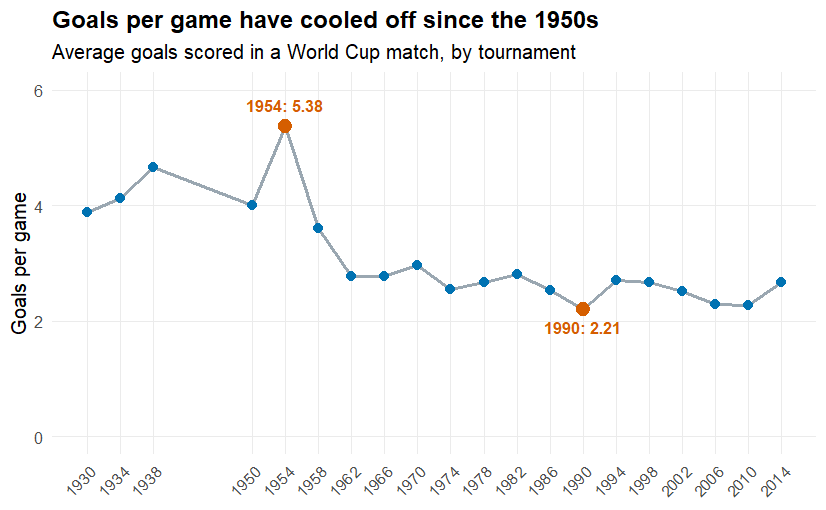
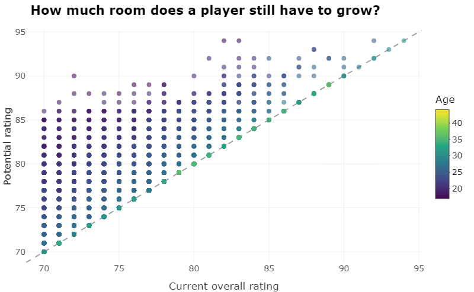
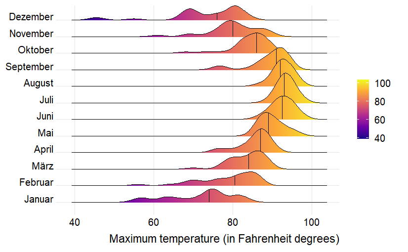

# Data Visualization and Reproducible Research

> Niklas Grau

The following is a sample of products created during the _"Data Visualization and Reproducible Research"_ course. The motivation behind all three projects was the same, to take a real dataset and turn it into something a person can actually read and learn from, while keeping the whole analysis reproducible from the raw data all the way to the final chart. The projects draw on football data, both World Cup match results and FIFA 18 player ratings, along with a year of daily weather from Tampa and a dataset of concrete mixes, so together they cover a fairly wide range of data types and chart styles.

## Project 01

In the `project_01/` folder you can find a short visual history of the FIFA World Cup, built from every match played between 1930 and 2014. It answers three questions a fan might ask: whether games have fewer goals than they used to, whether the crowds have grown, and which countries have scored the most. Along the way it shows that scoring peaked in the 1950s and has cooled off since, that attendance climbed steadily as the tournament went global, and that Brazil sits far ahead of everyone else. The report also includes an interactive chart for exploring every tournament at once and a before and after redesign of the attendance chart.

**Sample data visualization:** 

The goals per game line chart, which was my favorite because it overturned what I assumed. I always thought modern football had more goals, not fewer, and seeing the 1954 peak next to the 1990 low made the story click in one picture.

## Project 02

In this project I dug into the FIFA 18 player dataset, around seventeen thousand players with forty attributes each, to ask what separates the best footballers from the rest and where in the world they come from. The report walks through how ratings rise and fall with age, how much room young players have to grow, a world map of national strength, and a model of which attributes the overall rating actually rewards. It also includes an interactive scatter for exploring individual players and a before and after redesign of the age curve. Find the code and report in the `project_02/` folder.

**Sample data visualization:** 

The interactive room to grow scatter, my favorite from this project. It turns a flat cloud of points into something you can explore, hovering to find a cheap young player with a high ceiling sitting well above the line.

## Project 03

In this project I focused on exploring distributions and recreating a set of given charts. Part one rebuilds several views of Tampa's daily maximum temperatures in 2022, including a faceted histogram, density plots, and a plasma colored ridgeline, plus a precipitation chart of my own that shows the summer rainy season. Part two uses a dataset of 1030 concrete mixes to show how compressive strength depends on the recipe and on age, finishing with an interactive scatter of the mixes that you can hover and zoom.

**Sample data visualization:** 

The ridgeline plot of maximum temperature by month is my favorite here. Stacking the months and filling each ridge by temperature turns a whole year into one picture of the seasons sliding warmer and back again.

### Moving Forward

The biggest thing I took from this course is how much of good data visualization happens before the plot, in cleaning the data and deciding what single point each chart should make. I also came to appreciate the small choices that keep a chart honest and readable, like starting an axis at zero, picking a colorblind safe palette, and writing a title that states the takeaway instead of just naming the axes. Going forward I want to keep practicing interactivity, since letting a reader explore the data on their own turned out to be the most rewarding part, and I would like to get more comfortable with spatial data and with telling a longer story across several linked charts rather than one at a time.
